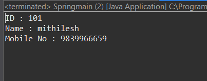

# Spring Framework – Annotation Based Configuration

A professional Spring Framework project demonstrating **Annotation-based configuration** without XML.  
This project is ideal for beginners and freshers who want to understand how Spring works using annotations like `@Component`, `@Autowired`, `@Configuration`, and `@ComponentScan`.

---

## 📌 Project Overview

This project shows how to configure and run a Spring application using **pure annotations** instead of XML configuration.  
It helps in understanding **IoC (Inversion of Control)** and **Dependency Injection (DI)** in a clean and modern way.

---

## 🛠️ Technologies Used

- Java (JDK 8+)
- Spring Framework
- Eclipse IDE
- Maven (Optional)
- Annotations-based Configuration

---

## 📂 Project Structure

spring-annotation-based-configuration/
│
├── .settings/                     # Eclipse IDE settings
├── bin/                           # Compiled .class files
├── screenshots/                   # Project output screenshots
│   └── output.png
│
├── src/
│   └── cs/
│       ├── bean/
│       │   └── Stud.java          # Model / Bean class
│       │
│       ├── config/
│       │   └── app.xml            # Spring configuration file
│       │
│       ├── main/
│       │   └── Springmain.java    # Main class (Application entry point)
│       │
│       └── repo/
│           └── Stdrepo.java       # Repository / DAO layer
│
├── .classpath                     # Eclipse classpath config
├── .project                       # Eclipse project config
├── .gitignore.txt                 # Git ignored files list
└── README.md.txt                  # Project documentation

---

## 🧩 Key Annotations Used

- `@Component`
- `@Autowired`
- `@Configuration`
- `@ComponentScan`
- `@Bean`

---

## 📦 Package Explanation

### `cs.bean`
- Contains model / bean classes
- Uses Spring annotations like `@Component`

### `cs.config`
- Spring configuration file
- Manages component scanning and bean configuration

### `cs.repo`
- Repository / DAO layer
- Handles business logic or data operations

### `cs.main`
- Main class to start the Spring application

---

## ▶️ How to Run the Project

### 1️⃣ Clone the Repository
```bash
git clone: https://github.com/mkmishra2503/spring_annotation_based_configuration.git
```
---

### 2️⃣ Open in Eclipse

- Open Eclipse
- File → Import → Existing Projects into Workspace
- Select the project folder

### 3️⃣ Run the Application

- Go to MainApp.java
- Right click → Run As → Java Application

---

## 🖼️ Screenshots

### 🔹 Console Output


Application output after successful execution:

---

## 🎯 Learning Objectives

- Understand Spring Annotation-based Configuration
- Learn Dependency Injection without XML
- Improve project structure for real-world applications
- Create professional GitHub repositories

---

## 🚀 Future Enhancements

- Add Spring XML & Java Config comparison
- Convert project to Spring Boot
- Add database integration (JDBC/JPA)

---

👨‍💻 Author

Mithilesh Kumar Mishra
Java Developer | Spring Framework Enthusiast

---

⭐ Support

If you like this project, don’t forget to star ⭐ the repository
and share it with other learners!

Happy Coding 🚀
